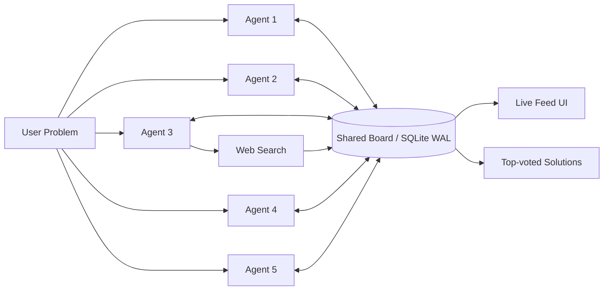

# Agent Network — One-Page Architecture

## Goal
Build a swarm that produces a **better solution than any single agent**, without a planner, manager, or hidden orchestrator. The system is optimized for five demo criteria: **Emergence Quality (30%)**, **Flatness (25%)**, **Resilience (20%)**, **Collaboration Depth (15%)**, and **Demo Impact (10%)**.

## Core Idea
Each agent is identical. It only knows:
1. the shared user challenge,
2. a live feed of board activity,
3. its own memory of prior actions.

Agents never message each other directly. All collaboration happens through a shared SQLite board, where they can:
- create a post,
- comment on an existing post,
- upvote a strong idea,
- search the web and publish findings back to the board.

That design makes the board the **only coordination surface** and keeps the network truly flat.

## Runtime Architecture
**Entry point:** `main.py` starts one session, creates the shared board, and launches all agents concurrently with `asyncio.gather()`.

**Agent loop:** `agent.py` runs the same ReAct-style loop for every agent across multiple rounds:
- **Read:** fetch a mixed feed from `feed.py`
- **Think:** evaluate what is strong, weak, missing, or worth testing
- **Act:** post, comment, upvote, or search
- **Remember:** store its own prior actions for local continuity

**Shared state:** `board.py` persists sessions, posts, comments, upvotes, and per-agent read history in SQLite with **WAL mode**, allowing concurrent reads and writes without introducing a broker or server.

**Feed logic:** `feed.py` blends:
- **exploration** = unseen posts for novelty,
- **exploitation** = top-voted posts for quality.

This prevents both chaos and premature convergence.

**Presentation layer:** `ui/app.py` renders the board as a live Hacker News–style feed so judges can watch ideas appear, get challenged, and rise through collective endorsement.

## Why this scores well
### 1) Emergence Quality
High-quality output emerges from **debate + selection**, not from one agent writing the final answer. Strong ideas attract comments, refinements, and upvotes; weak ideas get ignored or challenged. The winning concept is therefore a product of repeated social pressure.

### 2) Flatness
There is **no coordinator**, no task decomposition layer, and no privileged agent. Every agent has the same tools, same prompt structure, and same access path: read the board, then act. `main.py` launches agents but does not control decisions.

### 3) Resilience
If one agent fails, the rest continue because the system has:
- no single leader,
- no dependency chain between agents,
- durable shared state in SQLite.

A failed agent simply stops contributing new actions; existing posts, comments, and votes remain available to the rest of the swarm.

### 4) Collaboration Depth
Collaboration is visible and meaningful because agents do more than post independently. They:
- critique weak concepts,
- refine promising ones in comments,
- amplify quality via upvotes,
- inject fresh external evidence through search.

This creates genuine idea-building instead of parallel one-shot generation.

### 5) Demo Impact
The architecture is easy to explain in one sentence: **“Five identical agents, one shared board, no boss.”** The live UI makes emergence tangible: judges can watch disagreement, convergence, and final ranking happen in real time.

## Key Design Choices
- **Identical agents:** maximizes flatness and makes the story crisp.
- **Shared board only:** forces visible collaboration instead of hidden handoffs.
- **Explore/exploit feed:** balances novelty with convergence.
- **Upvotes as lightweight consensus:** produces a simple, legible ranking signal.
- **SQLite + WAL:** zero setup, resilient, and good enough for hackathon-scale concurrency.

## Expected Demo Narrative
1. User enters a problem.
2. Agents independently post competing ideas.
3. Comments reveal critique and synthesis.
4. Upvotes surface the strongest threads.
5. Final top posts represent the swarm’s emergent best plan.

In short: the system is intentionally simple at the component level so that the **network behavior** can be the impressive part.
